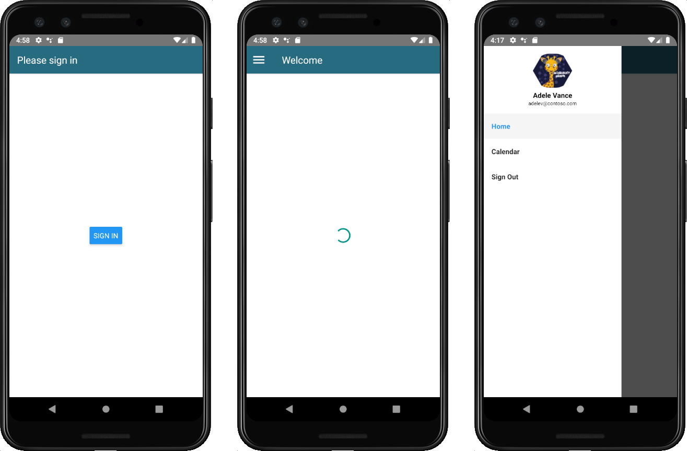
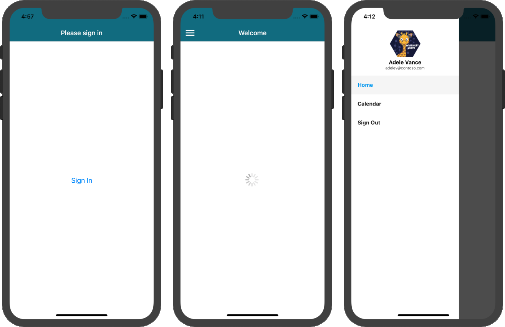

<!-- markdownlint-disable MD002 MD041 -->

Begin by creating a new React Native project.

1. Open your command line interface (CLI) in a directory where you want to create the project. Run the following command to run the [react-native-cli](https://github.com/facebook/react-native) tool and create a new React Native project.

    ```Shell
    npx react-native init GraphTutorial --template react-native-template-typescript
    ```

1. **Optional:** Verify that your development environment is configured correctly by running the project. In your CLI, change the directory to the **GraphTutorial** directory you just created, and run one of the following commands.

    - For iOS: `npx react-native run-ios`
    - For Android: Launch an Android emulator instance and run `npx react-native run-android`

## Install dependencies

Before moving on, install some additional dependencies that you will use later.

- [react-navigation](https://reactnavigation.org) to handle navigation between views in the app.
- [react-native-gesture-handler](https://github.com/kmagiera/react-native-gesture-handler), [react-native-safe-area-context](https://github.com/th3rdwave/react-native-safe-area-context), [react-native-screens](https://github.com/kmagiera/react-native-screens), [react-native-reanimate](https://github.com/kmagiera/react-native-reanimated), and [masked-view](https://github.com/react-native-community/react-native-masked-view) required by react-navigation.
- [react-native-elements](https://reactnativeelements.com/docs/) and [react-native-vector-icons](https://github.com/oblador/react-native-vector-icons) to provide icons for the UI.
- [react-native-app-auth](https://github.com/FormidableLabs/react-native-app-auth) to handle authentication and token management.
- [async-storage](https://react-native-async-storage.github.io/async-storage/docs/install) to provide storage for tokens.
- [moment](https://momentjs.com) to handle parsing and comparison of dates and times.
- [microsoft-graph-client](https://github.com/microsoftgraph/msgraph-sdk-javascript) for making calls to the Microsoft Graph.

1. Open your CLI in the root directory of your React Native project.
1. Run the following command.

    ```Shell
    npm install @react-navigation/native@5.8.1 @react-navigation/drawer@5.10.1 @react-navigation/stack@5.11.0
    npm install @react-native-community/masked-view@0.1.10 react-native-safe-area-context@3.1.8
    npm install react-native-reanimated@1.13.1 react-native-screens@2.12.0 @react-native-async-storage/async-storage@1.13.1
    npm install react-native-elements@2.3.2 react-native-vector-icons@7.1.0 react-native-gesture-handler@1.8.0
    npm install react-native-app-auth@6.0.0 moment@2.29.1 @microsoft/microsoft-graph-client@2.1.0
    ```

### Link and configure dependencies for iOS

> [!NOTE]
> If you are not targeting iOS, you can skip this section.

1. Open your CLI in the **GraphTutorial/ios** directory.
1. Run the following command.

    ```Shell
    pod install
    ```

1. Open the **GraphTutorial/ios/GraphTutorial/Info.plist** file in a text editor. Add the following just before the last `</dict>` line in the file.

    ```xml
    <key>UIAppFonts</key>
    <array>
      <string>AntDesign.ttf</string>
      <string>Entypo.ttf</string>
      <string>EvilIcons.ttf</string>
      <string>Feather.ttf</string>
      <string>FontAwesome.ttf</string>
      <string>FontAwesome5_Brands.ttf</string>
      <string>FontAwesome5_Regular.ttf</string>
      <string>FontAwesome5_Solid.ttf</string>
      <string>Foundation.ttf</string>
      <string>Ionicons.ttf</string>
      <string>MaterialIcons.ttf</string>
      <string>MaterialCommunityIcons.ttf</string>
      <string>SimpleLineIcons.ttf</string>
      <string>Octicons.ttf</string>
      <string>Zocial.ttf</string>
    </array>
    ```

1. Open the **GraphTutorial/ios/GraphTutorial/AppDelegate.h** file in a text editor. Replace its contents with the following.

    :::code language="objc" source="../demo/GraphTutorial/ios/GraphTutorial/AppDelegate.h":::

### Configure dependencies for Android

> [!NOTE]
> If you are not targeting Android, you can skip this section.

1. Open the **GraphTutorial/android/app/build.gradle** file in an editor.
1. Locate the `defaultConfig` entry and add the following property inside `defaultConfig`.

    ```Gradle
    manifestPlaceholders = [
        appAuthRedirectScheme: 'graph-tutorial'
    ]
    ```

    The `defaultConfig` entry should look similar to the following.

    :::code language="gradle" source="../demo/GraphTutorial/android/app/build.gradle" id="DefaultConfigSnippet":::

1. Add the following line to the end of the file.

    ```Gradle
    apply from: "../../node_modules/react-native-vector-icons/fonts.gradle"
    ```

1. Save the file.

## Design the app

The application will use a [navigation drawer](https://reactnavigation.org/docs/drawer-based-navigation.html) to navigate between different views. In this step you will create the basic views used by the app and implement the navigation drawer.

### Create views

In this section you will create the views for the app to support an [authentication flow](https://reactnavigation.org/docs/auth-flow).

1. Open **GraphTutorial/index.js** and add the following to the top of the file, before any other `import` statements.

    ```javascript
    import 'react-native-gesture-handler';
    ```

1. Create a new file in the **GraphTutorial** directory named **AuthContext.tsx** and add the following code.

    :::code language="typescript" source="../demo/GraphTutorial/AuthContext.tsx" id="AuthContextSnippet":::

1. Create a new directory in the **GraphTutorial** directory named **screens**.
1. Create a new file in the **GraphTutorial/screens** directory named **HomeScreen.tsx**. Add the following code to the file.

    ```typescript
    import React from 'react';
    import {
      ActivityIndicator,
      Alert,
      StyleSheet,
      Text,
      View,
    } from 'react-native';
    import { createStackNavigator } from '@react-navigation/stack';
    import { DrawerToggle, headerOptions } from '../menus/HeaderComponents';

    const Stack = createStackNavigator();
    const UserState = React.createContext({userLoading: true, userName: ''});

    type HomeScreenState = {
      userLoading: boolean;
      userName: string;
    }

    const HomeComponent = () => {
      const userState = React.useContext(UserState);

      return (
        <View style={styles.container}>
          <ActivityIndicator animating={userState.userLoading} size='large' />
          {userState.userLoading ? null: <Text>Hello {userState.userName}!</Text>}
        </View>
      );
    }

    export default class HomeScreen extends React.Component {

      state: HomeScreenState = {
        userLoading: true,
        userName: ''
      };

      render() {
        return (
          <UserState.Provider value={this.state}>
              <Stack.Navigator screenOptions={headerOptions}>
                <Stack.Screen name='Home'
                  component={HomeComponent}
                  options={{
                    title: 'Welcome',
                    headerLeft: () => <DrawerToggle/>
                  }} />
              </Stack.Navigator>
          </UserState.Provider>
        );
      }
    }

    const styles = StyleSheet.create({
      container: {
        flex: 1,
        alignItems: 'center',
        justifyContent: 'center'
      }
    });
    ```

1. Create a new file in the **GraphTutorial/screens** directory named **CalendarScreen.tsx**. Add the following code to the file.

    ```typescript
    import React from 'react';
    import {
      Text,
      StyleSheet,
      View,
    } from 'react-native';
    import { createStackNavigator } from '@react-navigation/stack';
    import { DrawerToggle, headerOptions } from '../menus/HeaderComponents';

    const Stack = createStackNavigator();

    // Temporary placeholder view
    const CalendarComponent = () => (
      <View style={styles.container}>
        <Text>Calendar</Text>
      </View>
    );

    export default class CalendarScreen extends React.Component {

      render() {
        return (
          <Stack.Navigator screenOptions={ headerOptions }>
            <Stack.Screen name='Calendar'
              component={ CalendarComponent }
              options={{
                title: 'Calendar',
                headerLeft: () => <DrawerToggle/>
              }} />
          </Stack.Navigator>
        );
      }
    }

    const styles = StyleSheet.create({
      container: {
        flex: 1,
        alignItems: 'center',
        justifyContent: 'center'
      }
    });
    ```

1. Create a new file in the **GraphTutorial/screens** directory named **SignInScreen.tsx**. Add the following code to the file.

    ```typescript
    // Adapted from https://reactnavigation.org/docs/auth-flow
    import React from 'react';
    import {
      Alert,
      Button,
      StyleSheet,
      View,
    } from 'react-native';
    import { ParamListBase } from '@react-navigation/native';
    import { StackNavigationProp } from '@react-navigation/stack'

    import { AuthContext } from '../AuthContext';

    type SignInProps = {
      navigation: StackNavigationProp<ParamListBase>;
    };

    export default class SignInScreen extends React.Component<SignInProps> {
      static contextType = AuthContext;

      _signInAsync = async () => {
        await this.context.signIn();
      };

      componentDidMount() {
        this.props.navigation.setOptions({
          title: 'Please sign in',
          headerShown: true
        });
      }

      render() {
        return (
          <View style={styles.container}>
            <Button title='Sign In' onPress={this._signInAsync}/>
          </View>
        );
      }
    }

    const styles = StyleSheet.create({
      container: {
        flex: 1,
        alignItems: 'center',
        justifyContent: 'center'
      }
    });
    ```

1. Create a new file in the **GraphTutorial/screens** directory named **AuthLoadingScreen.tsx**. Add the following code to the file.

    :::code language="typescript" source="../demo/GraphTutorial/screens/AuthLoadingScreen.tsx" id="AuthLoadingScreenSnippet":::

### Create a navigation drawer

In this section you will create a menu for the application, and update the application to use react-navigation to move between screens.

1. Create a new directory in the **GraphTutorial** directory named **menus**.
1. Create a new file in the **GraphTutorial/menus** directory named **HeaderComponents.tsx**. Add the following code to the file.

    :::code language="typescript" source="../demo/GraphTutorial/menus/HeaderComponents.tsx" id="HeaderComponentSnippet":::

1. Create a new file in the **GraphTutorial/menus** directory named **DrawerMenu.tsx**. Add the following code to the file.

    ```typescript
    import React, { FC } from 'react';
    import {
      Alert,
      Image,
      StyleSheet,
      Text,
      View,
      ImageSourcePropType
    } from 'react-native';
    import {
      createDrawerNavigator,
      DrawerContentScrollView,
      DrawerItem,
      DrawerItemList,
      DrawerContentComponentProps
    } from '@react-navigation/drawer';
    import { ParamListBase } from '@react-navigation/native';
    import { StackNavigationProp } from '@react-navigation/stack'

    import { AuthContext } from '../AuthContext';
    import HomeScreen from '../screens/HomeScreen';
    import CalendarScreen from '../screens/CalendarScreen';

    const Drawer = createDrawerNavigator();

    type CustomDrawerContentProps = DrawerContentComponentProps & {
      userName: string;
      userEmail: string;
      userPhoto: ImageSourcePropType;
      signOut: () => void;
    }

    type DrawerMenuState = {
      userName: string;
      userEmail: string;
      userPhoto: ImageSourcePropType;
    }

    type DrawerMenuProps = {
      navigation: StackNavigationProp<ParamListBase>;
    }

    const CustomDrawerContent: FC<CustomDrawerContentProps> = props => (
      <DrawerContentScrollView {...props}>
          <View style={styles.profileView}>
            <Image source={props.userPhoto}
              resizeMode='contain'
              style={styles.profilePhoto} />
            <Text style={styles.profileUserName}>{props.userName}</Text>
            <Text style={styles.profileEmail}>{props.userEmail}</Text>
          </View>
          <DrawerItemList {...props} />
          <DrawerItem label='Sign Out' onPress={props.signOut}/>
      </DrawerContentScrollView>
    );

    export default class DrawerMenuContent extends React.Component<DrawerMenuProps, DrawerMenuState> {
      static contextType = AuthContext;

      state: DrawerMenuState = {
        // TEMPORARY
        userName: 'Adele Vance',
        userEmail: 'adelev@contoso.com',
        userPhoto: require('../images/no-profile-pic.png')
      }

      _signOut = async () => {
        this.context.signOut();
      }

      componentDidMount() {
        this.props.navigation.setOptions({
          headerShown: false,
        });
      }

      render() {
        return (
          <Drawer.Navigator
            drawerType='front'
            drawerContent={props => (
              <CustomDrawerContent {...props}
                userName={this.state.userName}
                userEmail={this.state.userEmail}
                userPhoto={this.state.userPhoto}
                signOut={this._signOut} />
            )}>
            <Drawer.Screen name='Home'
              component={HomeScreen}
              options={{drawerLabel: 'Home'}} />
            <Drawer.Screen name='Calendar'
              component={CalendarScreen}
              options={{drawerLabel: 'Calendar'}} />
          </Drawer.Navigator>
        );
      }
    }

    const styles = StyleSheet.create({
      container: {
        flex: 1
      },
      profileView: {
        alignItems: 'center',
        padding: 10
      },
      profilePhoto: {
        width: 80,
        height: 80,
        borderRadius: 40
      },
      profileUserName: {
        fontWeight: '700'
      },
      profileEmail: {
        fontWeight: '200',
        fontSize: 10
      }
    });
    ```

1. Create a new directory in the **GraphTutorial** directory named **images**.
1. Add a default profile image named **no-profile-pic.png** in this directory. You can use any image you like, or use [the one from this sample](https://github.com/microsoftgraph/msgraph-training-react-native/blob/master/demo/GraphTutorial/images/no-profile-pic.png).

1. Open the **GraphTutorial/App.tsx** file and replace the entire contents with the following.

    ```typescript
    // Adapted from https://reactnavigation.org/docs/auth-flow
    import * as React from 'react';
    import { NavigationContainer, ParamListBase } from '@react-navigation/native';
    import { createStackNavigator, StackNavigationProp } from '@react-navigation/stack'

    import { AuthContext } from './AuthContext';
    import SignInScreen from './screens/SignInScreen';
    import DrawerMenuContent from './menus/DrawerMenu'
    import AuthLoadingScreen from './screens/AuthLoadingScreen';

    const Stack = createStackNavigator();

    type Props = {
      navigation: StackNavigationProp<ParamListBase>;
    };

    export default function App({ navigation }: Props) {
      const [state, dispatch] = React.useReducer(
        (prevState: any, action: any) => {
          switch (action.type) {
            case 'RESTORE_TOKEN':
              return {
                ...prevState,
                userToken: action.token,
                isLoading: false
              };
            case 'SIGN_IN':
              return {
                ...prevState,
                isSignOut: false,
                userToken: action.token
              }
            case 'SIGN_OUT':
              return {
                ...prevState,
                isSignOut: true,
                userToken: null
              }
          }
        },
        {
          isLoading: true,
          isSignOut: false,
          userToken: null
        }
      );

      React.useEffect(() => {
        const bootstrapAsync = async () => {
          let userToken = null;
          // TEMPORARY
          dispatch({ type: 'RESTORE_TOKEN', token: userToken });
        };

        bootstrapAsync();
      }, []);

      const authContext = React.useMemo(
        () => ({
          signIn: async () => {
            dispatch({ type: 'SIGN_IN', token: 'placeholder-token' });
          },
          signOut: async () => {
            dispatch({ type: 'SIGN_OUT' });
          }
        }),
        []
      );

      return (
        <AuthContext.Provider value={authContext}>
          <NavigationContainer>
            <Stack.Navigator>
              {state.isLoading ? (
                <Stack.Screen name="Loading" component={AuthLoadingScreen} />
              ) : state.userToken == null ? (
                <Stack.Screen name="SignIn" component={SignInScreen} />
              ) : (
                <Stack.Screen name="Main" component={DrawerMenuContent} />
              )}
            </Stack.Navigator>
          </NavigationContainer>
        </AuthContext.Provider>
      );
    }
    ```

1. Save all of your changes.

1. Reload the application in your emulator.

The app's menu should work to navigate between the two fragments and change when you tap the **Sign in** or **Sign out** buttons.




