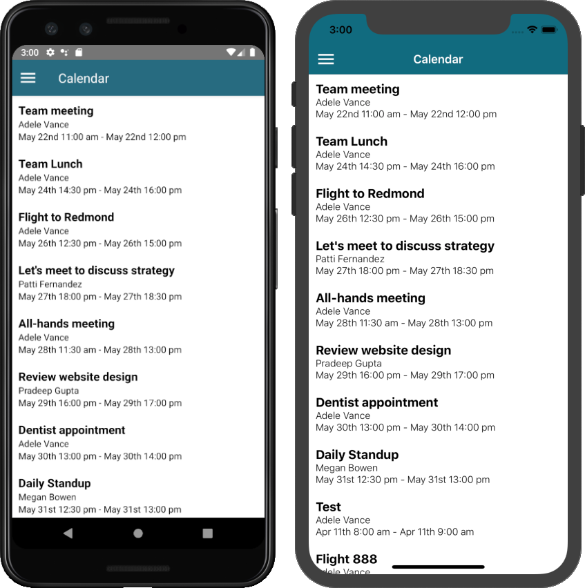

<!-- markdownlint-disable MD002 MD041 -->

In this exercise you will incorporate the Microsoft Graph into the application. For this application, you will use the [Microsoft Graph JavaScript Client Library](https://github.com/microsoftgraph/msgraph-sdk-javascript) to make calls to Microsoft Graph.

## Get calendar events from Outlook

In this section you will extend the `GraphManager` class to add a function to get the user's events and update `CalendarScreen` to use these new functions.

1. Open the **GraphTutorial/graph/GraphManager.js** file and add the following method to the `GraphManager` class.

    ```js
    static getEvents = async() => {
      // GET /me/events
      return graphClient.api('/me/events')
        // $select='subject,organizer,start,end'
        // Only return these fields in results
        .select('subject,organizer,start,end')
        // $orderby=createdDateTime DESC
        // Sort results by when they were created, newest first
        .orderby('createdDateTime DESC')
        .get();
    }
    ```

    > [!NOTE]
    > Consider what the code in `getEvents` is doing.
    >
    > - The URL that will be called is `/v1.0/me/events`.
    > - The `select` function limits the fields returned for each events to just those the app will actually use.
    > - The `orderby` function sorts the results by the date and time they were created, with the most recent item being first.

1. Open the **GraphTutorial/views/CalendarScreen.js** and replace its entire contents with the following code.

    ```js
    import React from 'react';
    import {
      ActivityIndicator,
      Modal,
      ScrollView,
      StyleSheet,
      Text,
      View,
    } from 'react-native';
    import { Icon } from 'react-native-elements';
    import { GraphManager } from '../graph/GraphManager';

    export default class CalendarScreen extends React.Component {
      static navigationOptions = ({navigation}) => {
        return {
          title: 'Calendar',
          headerLeft: <Icon iconStyle={{ marginLeft: 10, color: 'white' }} size={30} name="menu" onPress={navigation.toggleDrawer} />
        };
      }

      state = {
        loadingEvents: true,
        events: []
      };

      async componentDidMount() {
        try {
          const events = await GraphManager.getEvents();

          this.setState({
            loadingEvents: false,
            events: events.value
          });
        } catch(error) {
          alert(error);
        }
      }

      // Temporary JSON view
      render() {
        return (
          <View style={styles.container}>
            <Modal visible={this.state.loadingEvents}>
              <View style={styles.loading}>
                <ActivityIndicator animating={this.state.loadingEvents} size='large' />
              </View>
            </Modal>
            <ScrollView>
              <Text>{JSON.stringify(this.state.events, null, 2)}</Text>
            </ScrollView>
          </View>
        );
      }
    }

    const styles = StyleSheet.create({
      container: {
        flex: 1
      },
      loading: {
        flex: 1,
        justifyContent: 'center',
        alignItems: 'center'
      }
    });
    ```

You can now run the app, sign in, and tap the **Calendar** navigation item in the menu. You should see a JSON dump of the events in the app.

## Display the results

Now you can replace the JSON dump with something to display the results in a user-friendly manner. In this section, you will add a `ListView` to the calendar fragment, create a layout for each item in the `ListView`, and create a custom list adapter for the `ListView` that maps the fields of each `Event` to the appropriate `TextView` in the view.

1. Replace the `TextView` in **app/res/layout/fragment_calendar.xml** with a `ListView`.

    ```xml
    <ListView
        android:id="@+id/eventlist"
        android:layout_width="match_parent"
        android:layout_height="match_parent"
        android:divider="@color/colorPrimary"
        android:dividerHeight="1dp" />
    ```

1. Right-click the **app/res/layout** folder and select **New**, then **Layout resource file**.

1. Name the file `event_list_item`, change the **Root element** to `RelativeLayout`, and select **OK**.

1. Open the **event_list_item.xml** file and replace its contents with the following.

    ```xml
    <?xml version="1.0" encoding="utf-8"?>
    <RelativeLayout xmlns:android="http://schemas.android.com/apk/res/android"
        android:layout_width="match_parent"
        android:layout_height="match_parent"
        android:padding="10dp">

        <TextView
            android:id="@+id/eventsubject"
            android:layout_width="match_parent"
            android:layout_height="wrap_content"
            android:text="Subject"
            android:textSize="20sp" />

        <TextView
            android:id="@+id/eventorganizer"
            android:layout_width="match_parent"
            android:layout_height="wrap_content"
            android:layout_below="@id/eventsubject"
            android:text="Adele Vance"
            android:textSize="15sp" />

        <LinearLayout
            android:layout_width="match_parent"
            android:layout_height="wrap_content"
            android:layout_below="@id/eventorganizer"
            android:orientation="horizontal">

            <TextView
                android:layout_width="wrap_content"
                android:layout_height="wrap_content"
                android:paddingEnd="2sp"
                android:text="Start:"
                android:textSize="15sp"
                android:textStyle="bold" />

            <TextView
                android:id="@+id/eventstart"
                android:layout_width="wrap_content"
                android:layout_height="wrap_content"
                android:text="1:30 PM 2/19/2019"
                android:textSize="15sp" />

            <TextView
                android:layout_width="wrap_content"
                android:layout_height="wrap_content"
                android:paddingStart="5sp"
                android:paddingEnd="2sp"
                android:text="End:"
                android:textSize="15sp"
                android:textStyle="bold" />

            <TextView
                android:id="@+id/eventend"
                android:layout_width="wrap_content"
                android:layout_height="wrap_content"
                android:text="1:30 PM 2/19/2019"
                android:textSize="15sp" />
        </LinearLayout>
    </RelativeLayout>
    ```

1. Right-click the **app/java/com.example.graphtutorial** folder and select **New**, then **Java Class**.

1. Name the class `EventListAdapter` and select **OK**.

1. Open the **EventListAdapter** file and replace its contents with the following.

    ```java
    package com.example.graphtutorial;

    import android.content.Context;
    import android.support.annotation.NonNull;
    import android.view.LayoutInflater;
    import android.view.View;
    import android.view.ViewGroup;
    import android.widget.ArrayAdapter;
    import android.widget.TextView;

    import com.microsoft.graph.models.extensions.DateTimeTimeZone;
    import com.microsoft.graph.models.extensions.Event;

    import java.time.LocalDateTime;
    import java.time.ZoneId;
    import java.time.ZonedDateTime;
    import java.time.format.DateTimeFormatter;
    import java.time.format.FormatStyle;
    import java.util.List;
    import java.util.TimeZone;

    public class EventListAdapter extends ArrayAdapter<Event> {
        private Context mContext;
        private int mResource;
        private ZoneId mLocalTimeZoneId;

        // Used for the ViewHolder pattern
        // https://developer.android.com/training/improving-layouts/smooth-scrolling
        static class ViewHolder {
            TextView subject;
            TextView organizer;
            TextView start;
            TextView end;
        }

        public EventListAdapter(Context context, int resource, List<Event> events) {
            super(context, resource, events);
            mContext = context;
            mResource = resource;
            mLocalTimeZoneId = TimeZone.getDefault().toZoneId();
        }

        @NonNull
        @Override
        public View getView(int position, View convertView, ViewGroup parent) {
            Event event = getItem(position);

            ViewHolder holder;

            if (convertView == null) {
                LayoutInflater inflater = LayoutInflater.from(mContext);
                convertView = inflater.inflate(mResource, parent, false);

                holder = new ViewHolder();
                holder.subject = convertView.findViewById(R.id.eventsubject);
                holder.organizer = convertView.findViewById(R.id.eventorganizer);
                holder.start = convertView.findViewById(R.id.eventstart);
                holder.end = convertView.findViewById(R.id.eventend);

                convertView.setTag(holder);
            } else {
                holder = (ViewHolder) convertView.getTag();
            }

            holder.subject.setText(event.subject);
            holder.organizer.setText(event.organizer.emailAddress.name);
            holder.start.setText(getLocalDateTimeString(event.start));
            holder.end.setText(getLocalDateTimeString(event.end));

            return convertView;
        }

        // Convert Graph's DateTimeTimeZone format to
        // a LocalDateTime, then return a formatted string
        private String getLocalDateTimeString(DateTimeTimeZone dateTime) {
            ZonedDateTime localDateTime = LocalDateTime.parse(dateTime.dateTime)
                    .atZone(ZoneId.of(dateTime.timeZone))
                    .withZoneSameInstant(mLocalTimeZoneId);

            return String.format("%s %s",
                    localDateTime.format(DateTimeFormatter.ofLocalizedDate(FormatStyle.MEDIUM)),
                    localDateTime.format(DateTimeFormatter.ofLocalizedTime(FormatStyle.SHORT)));
        }
    }
    ```

1. Open the **CalendarFragment** class and add the following function to the class.

    ```java
    private void addEventsToList() {
        getActivity().runOnUiThread(new Runnable() {
            @Override
            public void run() {
                ListView eventListView = getView().findViewById(R.id.eventlist);

                EventListAdapter listAdapter = new EventListAdapter(getActivity(),
                        R.layout.event_list_item, mEventList);

                eventListView.setAdapter(listAdapter);
            }
        });
    }
    ```

1. Add the following line of code in the `success` override after the `mEventList = iEventCollectionPage.getCurrentPage();` line.

    ```java
    addEventsToList();
    ```

1. Run the app, sign in, and tap the **Calendar** navigation item. You should see the list of events.

    
